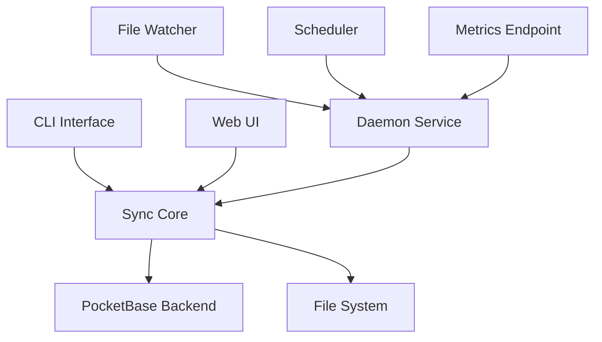

# Sync App

[](https://github.com/yourusername/sync-app/actions)
[](https://www.gnu.org/licenses/agpl-3.0)
[](https://yourusername.github.io/sync-app/)

A comprehensive, high-performance file synchronization application built in Rust with PocketBase backend. Sync App provides real-time file synchronization, conflict resolution, and monitoring capabilities with both CLI and daemon interfaces.

## 🚀 Quick Start

### Local Development Setup

1. **Clone and Build**
   ```bash
   git clone https://github.com/yourusername/sync-app.git
   cd sync-app
   cargo build --release
   ```

2. **Start PocketBase Backend**
   ```bash
   # On Windows
   .\pocketbase\setup.ps1
   
   # On Linux/macOS
   ./pocketbase/setup.sh
   ```

3. **Run Your First Sync**
   ```bash
   # Add a sync configuration
   ./target/release/sync add --name "documents" --source "./test-source" --dest "./test-backup"
   
   # Run the sync
   ./target/release/sync run <config-id>
   ```

4. **Start the Daemon (Optional)**
   ```bash
   ./target/release/daemon start --config ./daemon/examples/daemon-config.toml
   ```

5. **Launch Web UI (Optional)**
   ```bash
   ./target/release/ui
   # Open http://localhost:3000
   ```

## 📁 Project Structure

```
sync-app/
├── sync-core/          # Core synchronization engine
├── sync-cli/           # Command line interface
├── sync-server/        # Server component
├── sync/               # Sync library with conflict resolution
├── daemon/             # Background daemon service
├── ui/                 # Web-based user interface
├── pocketbase/         # PocketBase backend setup
├── docs/               # Comprehensive documentation
├── packaging/          # Distribution packages
└── scripts/            # Build and release scripts
```

## ✨ Key Features

- **🔄 Real-time Synchronization**: Bidirectional sync with file watching
- **⚡ High Performance**: Optimized Rust implementation with async I/O
- **🛠️ Conflict Resolution**: Smart conflict detection and resolution strategies
- **📊 Monitoring & Telemetry**: Prometheus metrics and structured logging
- **🌐 Web Interface**: Modern React-based UI for management
- **🔧 Flexible Configuration**: TOML-based configuration with live reload
- **📦 Cross-platform**: Windows, Linux, and macOS support
- **🔒 Secure**: Built-in authentication and encrypted transfers

## 🎯 Use Cases

- **Development Teams**: Keep codebases synchronized across environments
- **Content Creators**: Sync media files between workstations
- **Remote Work**: Maintain consistent file structures across devices
- **Backup Solutions**: Automated incremental backups with versioning
- **CI/CD Pipelines**: Sync build artifacts and deployment files

## 🏗️ Architecture Overview



## 📚 Documentation

- **[Quick Start Guide](docs/quick-start.md)** - Get up and running in minutes
- **[Production Deployment](docs/deployment.md)** - Production-ready setup guide
- **[Configuration Reference](docs/configuration.md)** - Complete configuration options
- **[CLI Usage](CLI_USAGE.md)** - Command-line interface documentation
- **[Troubleshooting](docs/troubleshooting.md)** - Common issues and solutions
- **[Examples](docs/examples/)** - Real-world usage examples

## 🛠️ Development

### Prerequisites
- Rust 1.70+ (stable toolchain)
- Git
- Node.js 18+ (for UI development)

### Building
```bash
# Debug build
cargo build

# Release build
cargo build --release

# Build specific component
cargo build --bin sync-cli
```

### Testing
```bash
# Run all tests
cargo test --workspace

# Run integration tests
cargo test --test integration_tests

# Test with coverage
cargo tarpaulin --all-features --workspace
```

### Code Quality
```bash
# Format code
cargo fmt

# Lint code
cargo clippy -- -D warnings

# Security audit
cargo audit
```

## 📦 Installation

### Pre-built Binaries
Download from [GitHub Releases](https://github.com/yourusername/sync-app/releases)

### Package Managers
```bash
# Homebrew (macOS/Linux)
brew install sync-app

# Chocolatey (Windows)
choco install sync-app

# Cargo
cargo install sync-app
```

### Docker
```bash
# Run daemon in container
docker run -d --name sync-daemon \
  -v /path/to/config:/config \
  -v /path/to/data:/data \
  sync-app:latest
```

## 🤝 Contributing

1. Fork the repository
2. Create a feature branch (`git checkout -b feature/amazing-feature`)
3. Make your changes
4. Run tests and linting (`cargo test && cargo clippy`)
5. Commit your changes (`git commit -m 'Add amazing feature'`)
6. Push to the branch (`git push origin feature/amazing-feature`)
7. Open a Pull Request

See [CONTRIBUTING.md](CONTRIBUTING.md) for detailed guidelines.

## 📄 License

This project is licensed under the GNU Affero General Public License v3.0 - see the [LICENSE](LICENSE) file for details.

## 🙏 Acknowledgments

- [PocketBase](https://pocketbase.io/) for the excellent backend framework
- [Tokio](https://tokio.rs/) for async runtime
- [Tauri](https://tauri.app/) for desktop application framework
- The Rust community for amazing crates and tools

## 📞 Support

- 📖 Documentation: [https://yourusername.github.io/sync-app/](https://yourusername.github.io/sync-app/)
- 🐛 Issues: [GitHub Issues](https://github.com/yourusername/sync-app/issues)
- 💬 Discussions: [GitHub Discussions](https://github.com/yourusername/sync-app/discussions)
- 📧 Email: support@example.com
