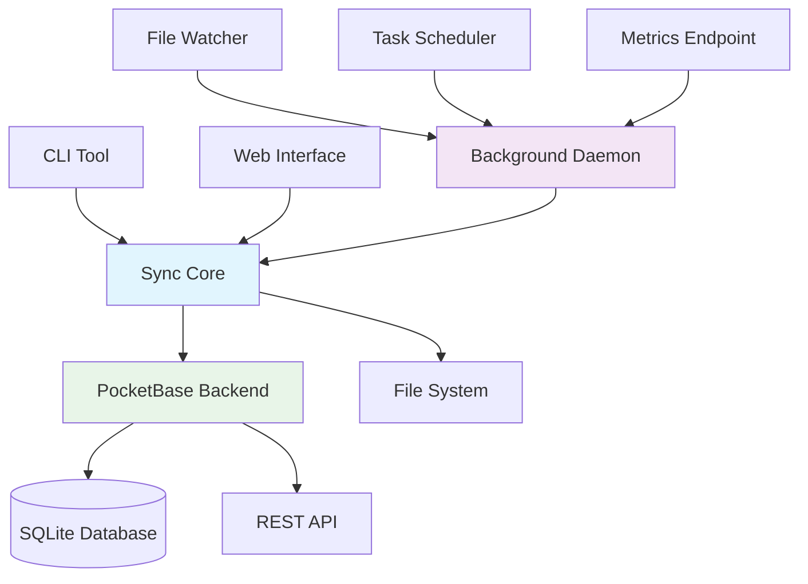

# Sync App Documentation

Welcome to the comprehensive documentation for **Sync App** - a high-performance file synchronization application built in Rust with PocketBase backend.

## What is Sync App?

Sync App provides reliable, efficient file synchronization with real-time monitoring, conflict resolution, and flexible scheduling. Whether you need simple one-way mirroring, complex bidirectional sync, or real-time file watching, Sync App delivers enterprise-grade performance with ease of use.

## 🚀 Quick Navigation

### New to Sync App?
- **[Quick Start Guide](quick-start.md)** - Get up and running in minutes
- **[Installation](installation.md)** - Multiple installation options
- **[Your First Sync](first-sync.md)** - Step-by-step tutorial

### Ready to Deploy?
- **[Production Deployment](deployment.md)** - Production-ready configurations
- **[Docker & Containers](deployment/docker.md)** - Containerized deployments
- **[Security Configuration](deployment/security.md)** - Secure your installation

### Need Examples?
- **[One-Way Mirror](examples/one-way-mirror.md)** - Perfect for backups
- **[Bidirectional Sync](examples/bidirectional-cron.md)** - Two-way synchronization
- **[File Watcher Demo](examples/watcher-demo.md)** - Real-time sync

## ✨ Key Features

### 🔄 **Flexible Synchronization**
- **One-way and bidirectional** sync support
- **Real-time file watching** with configurable debounce
- **Scheduled sync** with cron expressions and intervals
- **Manual triggers** for on-demand operations

### ⚡ **High Performance**
- **Async Rust implementation** for maximum efficiency
- **Concurrent operations** with configurable limits
- **Smart caching** to avoid redundant operations
- **Multiple comparison methods** (size, time, hash)

### 🛠️ **Intelligent Conflict Resolution**
- **Configurable strategies** (newer, larger, source preference)
- **Detailed conflict logging** for audit trails
- **Manual resolution support** for complex scenarios
- **Backup creation** for safety

### 📊 **Comprehensive Monitoring**
- **Prometheus metrics** for operational insights
- **Structured logging** with JSON and console output
- **Real-time dashboard** via web interface
- **Health checks** and status monitoring

### 🔧 **Easy Configuration**
- **TOML-based configuration** with validation
- **Environment variable support** for deployments
- **Live configuration reload** without restarts
- **Migration tools** for upgrades

## 📋 Common Use Cases

| Use Case | Description | Example |
|----------|-------------|---------|
| **Backup & Archival** | One-way mirror for data protection | Documents → Backup drive |
| **Team Collaboration** | Bidirectional sync for shared workspaces | Local ↔ Network share |
| **Development Workflow** | Real-time sync for code changes | IDE ↔ Test environment |
| **Content Distribution** | Scheduled sync for content delivery | Source ↔ Multiple destinations |
| **Data Migration** | Bulk transfer with progress tracking | Old system → New system |

## 🏗️ Architecture Overview



## 📚 Documentation Structure

### Getting Started
Learn the basics and get your first sync running quickly.

### User Guide  
Complete reference for day-to-day usage, including CLI commands and configuration options.

### Deployment
Production deployment strategies, from simple systemd services to Kubernetes clusters.

### Monitoring & Operations
Keep your sync operations running smoothly with comprehensive monitoring and troubleshooting guides.

### Examples & Tutorials
Real-world scenarios with complete configurations and step-by-step instructions.

### Development
Information for contributors and developers who want to extend or modify Sync App.

### Reference
Detailed technical reference including API documentation, error codes, and configuration schemas.

## 🆘 Getting Help

### 📖 Documentation
- **Search**: Use the search box above to find specific topics
- **Navigation**: Browse by category using the sidebar
- **Links**: All internal links are validated automatically

### 🐛 Issues & Support
- **Bug Reports**: [GitHub Issues](https://github.com/yourusername/sync-app/issues)
- **Feature Requests**: [GitHub Discussions](https://github.com/yourusername/sync-app/discussions)
- **Questions**: [Community Forum](https://github.com/yourusername/sync-app/discussions/categories/q-a)

### 🤝 Community
- **Discussions**: [GitHub Discussions](https://github.com/yourusername/sync-app/discussions)
- **Contributing**: [Contributing Guide](development/contributing.md)
- **Matrix Chat**: `#sync-app:matrix.org` (if available)

## 🚀 Quick Start Example

Here's a taste of how simple Sync App is to use:

```bash
# 1. Start PocketBase backend
./pocketbase/setup.sh

# 2. Add a sync configuration
sync add --name "my-backup" --source "~/Documents" --dest "~/Backup"

# 3. Run the sync
sync run <config-id>

# 4. Start daemon for automated sync
daemon start --config daemon.toml
```

## 📄 License

Sync App is licensed under the GNU Affero General Public License v3.0. See the [LICENSE](../LICENSE) file for full details.

---

**Ready to get started?** Jump to the [Quick Start Guide](quick-start.md) or explore the [examples](examples/one-way-mirror.md) to see Sync App in action!
